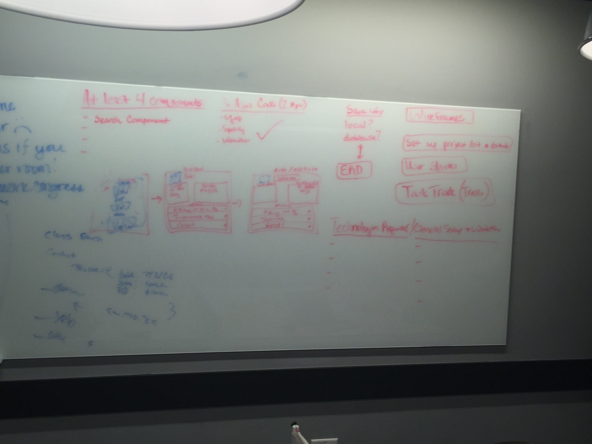

# Build-A-Date

Co-Creators:
  * Camille Morelle (Github: cemorelle)
  * Michael Malleske (Github: mmalleske)
  * Alfredo Amengual (Github: aamengual14)

Build-A-Date is a new idea targeting the Austin market meant to help inspire date ideas for its users. Users are able to connect to Spotify and listen to music while they create, check the weather for planning, and save your favorite ideas as you search through the Yelp API powered search features on the site. 

## Technologies Used
  * Express, Node.js
  * HTML/CSS
  * React
  * Bootstrap/Bootswatch/Font Awesome
  * Firebase
  * APIs - Yelp, Wunderground, Spotify
  

## Approach Taken
  * The first day was used to primarily plan for an idea and research APIs. Once an idea was determined, we researched necessary technologies to get the job done and began actual coding on the second day. 
  * The second and third day was focused on making succesful API calls and hitting our MVP. 
  * The 4th day was for adding bonus features and starting styling. 
  * The 5th day was final styling, deployment, and presentation planning. 

## Unsolved Problems
  * We were unable to get to a bonus feature that would allow the user to send the final date to their partner. The app functions more like a date idea generator to store dates ideas you like, chck out the weather for planning, and jam out to good music while doing it!

## User Stories

## Wire Frames

